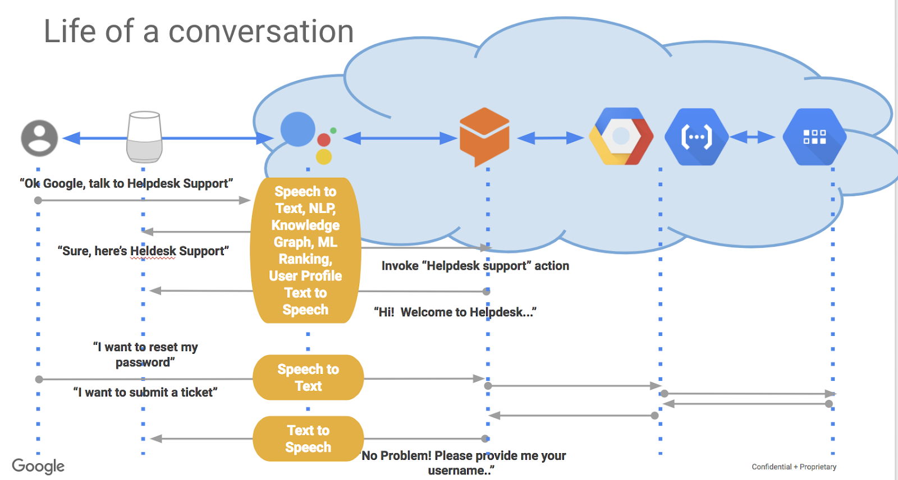

# Implementing an AI Chatbot with Dialogflow
Dialogflow is one of the hottest computer-human interaction platforms on the market. It offers all the services and complexities of natural language processing and machine learning, but uses a straightforward interface that allows you to start developing Assistant, Alexa, and Cortana integrated applications today. In this lab, you will build a Google Assistant chatbot that submits helpdesk tickets. The following is a diagram of the chatbot application on Google Cloud Platform:

## Dialogflow Concepts and Constructs
Dialogflow is a conversation building tool. It takes the human language and cleverly splits it into intents and arguments.

Agents are best described as NLU (Natural Language Understanding) modules. These can be included in your app, product, or service, and transforms natural user requests into actionable data. This transformation occurs when a user input matches one of the intents inside your agent.

Intents are the predefined or developer-defined components of agents that process a user's request. An intent represents a mapping between what a user says and what action should be taken by your software.

Intent interfaces have the following sections:
- User says
- Action
- Response
- Contexts

Entities are powerful tools used for extracting parameter values from natural language inputs. Any important data you want to get from a user's request will have a corresponding entity.

The entities used in a particular agent will depend on the parameter values that are expected to be returned as a result of the agent functioning. In other words, a developer does not need to create entities for every possible concept mentioned in the agent – only for those needed for actionable data.

There are 3 types of entities:
- System: defined by Dialogflow
- Developer: defined by a developer
- User: built for each individual end-user in every request

It's important to distinguish between the three different types of system entities:
- System mapping: Has reference values
- System enum: Has no reference values
- System composite: Contains other entities with aliases and returns object type values

Contexts represent the current context of a user's request. This is helpful for differentiating phrases which may be vague or have different meanings depending on the user's preferences, geographic location, the current page in an app, or the topic of conversation.

For example, if a user is listening to music and finds a band that catches their interest, they might say something like: "I want to hear more of them." As a developer, you can include the name of the band in the context with the request, so that the agent can use it in other intents.

Fulfillment is a webhook that allows you to pass information from a matched intent into a web service and get a result from it.

All of this new information may be overwhelming, but not to panic — it should all come together once you start developing your Google Assistant chatbot in the following section.